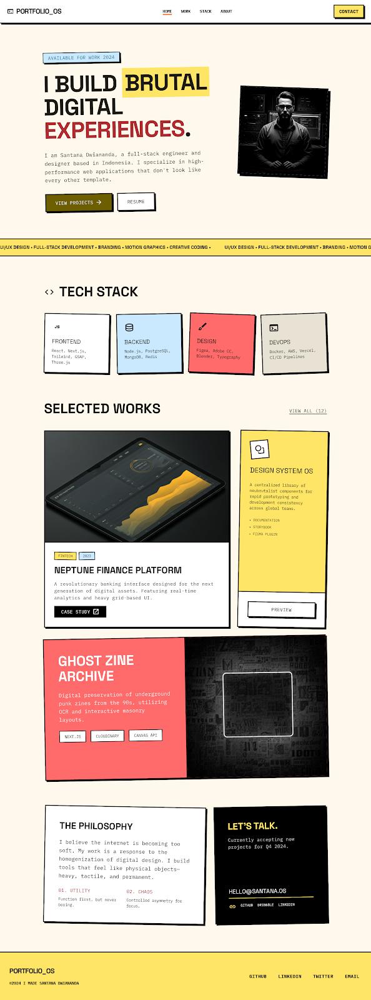

# Neubrutalism Portfolio

<div align="center">
  
</div>

A modern, responsive web portfolio built with React, TypeScript, and Tailwind CSS, featuring a distinctive **neubrutalism** design aesthetic. This project showcases bold colors, stark contrasts, thick borders, and solid shadows typical of the neubrutalist UI style.

## 🌟 Features

- **Neubrutalist Design System**: Bold typography, high-contrast colors, and distinctive hard shadows.
- **Responsive Layout**: Fully optimized for mobile, tablet, and desktop viewing.
- **Dynamic Routing**: Uses `react-router-dom` for seamless navigation between the main page and individual project case studies.
- **Component-Driven Architecture**: Modular components for Hero, Tech Stack, Projects, Contact, Header, and Footer.
- **Fast Build Times**: Powered by Vite for lightning-fast development and optimized production builds.

## 🚀 Tech Stack

- **Framework**: [React 19](https://react.dev/)
- **Language**: [TypeScript](https://www.typescriptlang.org/)
- **Styling**: [Tailwind CSS 3](https://tailwindcss.com/)
- **Routing**: [React Router 7](https://reactrouter.com/)
- **Build Tool**: [Vite](https://vitejs.dev/)

## 📁 Project Structure

```text
src/
├── assets/         # Images, icons, and other static assets
├── components/     # Reusable UI components
│   ├── Contact.tsx
│   ├── Footer.tsx
│   ├── Header.tsx
│   ├── Hero.tsx
│   ├── Layout.tsx
│   ├── Projects.tsx
│   └── TechStack.tsx
├── pages/          # Route components (Pages)
│   ├── Home.tsx
│   └── ProjectDetail.tsx
├── App.tsx         # Main application component & routing setup
├── index.css       # Global styles and Tailwind directives
└── main.tsx        # Application entry point
```

## 🛠️ Getting Started

### Prerequisites

- Node.js (v18 or higher recommended)
- npm or yarn

### Installation

1. **Clone the repository**
   ```bash
   git clone https://github.com/SantanaDwi29/neubrutalism_portofolio.git
   cd neubrutalism_portofolio
   ```

2. **Install dependencies**
   ```bash
   npm install
   ```

3. **Start the development server**
   ```bash
   npm run dev
   ```

4. **Open your browser**
   Navigate to `http://localhost:5173` to view the application.

## 📦 Build for Production

To create an optimized production build:

```bash
npm run build
```

This will generate a `dist` directory with your minified and bundled production files. You can preview the production build locally using:

```bash
npm run preview
```

## 🎨 Design System

The application relies on Tailwind CSS for styling. The neubrutalist aesthetic is achieved through specific class combinations:
- **Thick borders**: `border-[3px]` or `border-4 border-black`
- **Solid hard shadows**: `shadow-[4px_4px_0_0_#000]` or `shadow-[8px_8px_0_0_#000]`
- **Bold background colors**: vibrant colors combined with stark black contrast.
- **Interactive elements**: Elements have active state translation (e.g., `active:translate-x-1 active:translate-y-1 active:shadow-none`) to simulate physical button pressing.

Global styles, font configurations, and base utilities are managed via `tailwind.config.js` and `src/index.css`.
